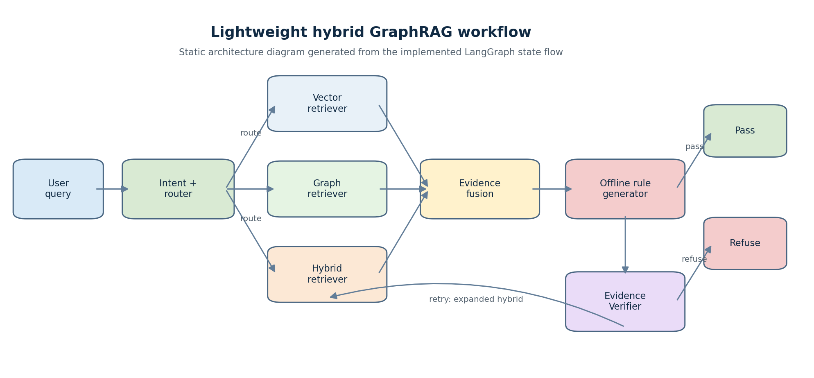
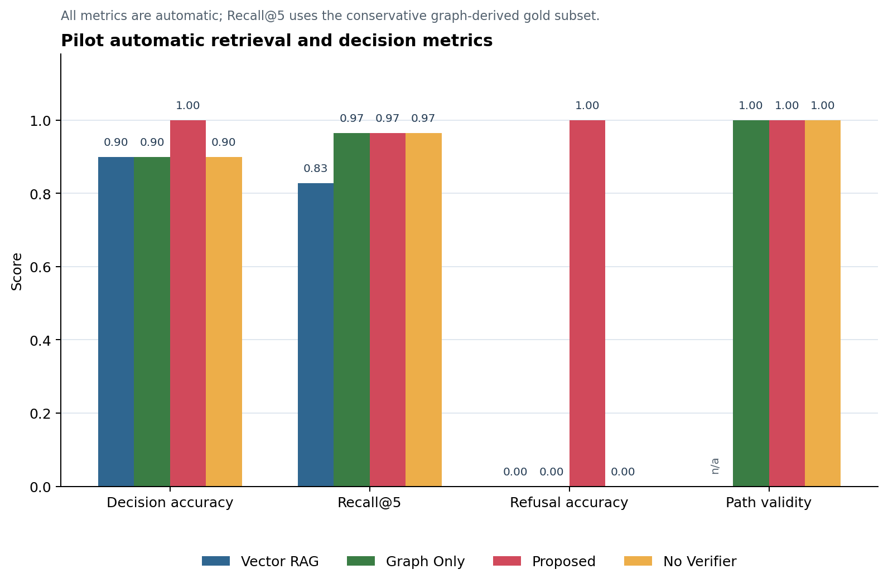
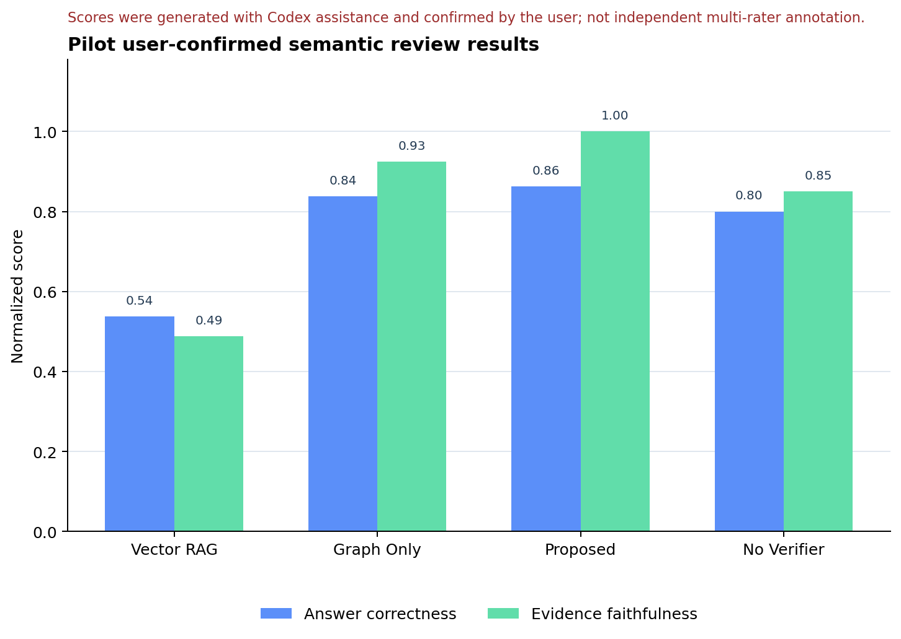
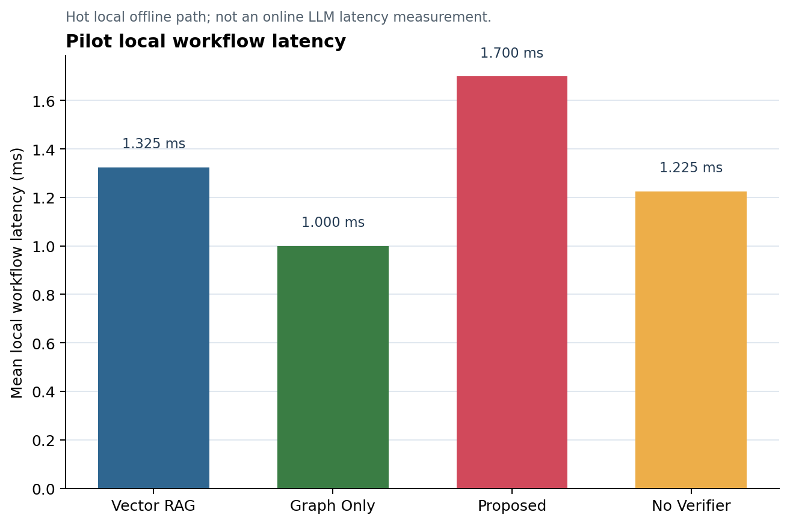
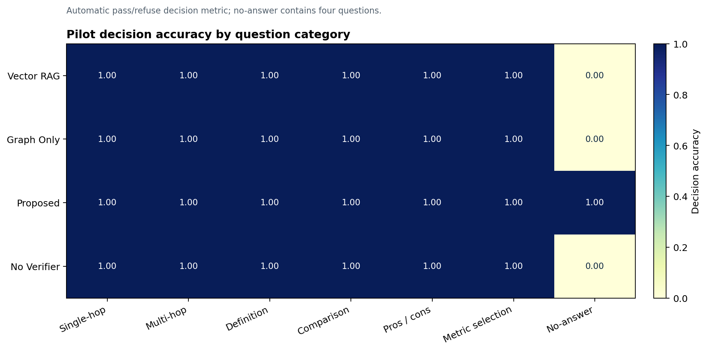

# 基于预定义知识图谱的轻量化混合 GraphRAG 机器学习知识问答 Agent

## 科研实践报告草稿

> - 版本：Draft v1
> - 项目路径：`E:\RAGagent`
> - 基线版本：`v1.0-baseline`
> - 当前实验分支：`experiment/llm-agent-v2`
> - 写作状态：方法、v1.0 基线、主实验、消融、用户确认语义评分和误差分析已填入；当前分支已接入 `qwen3:4b` Answer Generator、intent-aware Evidence Packer、原子 Claim Prompt v2、Verifier 与规则 fallback；v1 extension release 已在执行前撤销，v2 四方法 extension 与用户确认盲评均已完成。

## 摘要

面向机器学习领域知识问答中存在的文本检索语义不足、结构关系难以表达以及生成答案缺少证据约束等问题，本项目构建了一个以六页 scikit-learn 官方文档为文本来源、以预定义领域知识图谱为结构知识的轻量化混合 GraphRAG 问答 Agent。系统将 164 个文档 Section 切分为 180 个稳定 Chunk，并构建包含 50 个实体、100 条 approved 关系的双语知识图谱；每条图关系均绑定真实 Chunk 证据。系统使用 LangGraph 编排查询路由、Vector/Graph/Hybrid 三路检索、离线规则生成、证据验证、一次重试和保守拒答，并通过统一 `GraphRepository` 接口支持 NetworkX 离线后端与可选 Neo4j 后端。

本项目严格区分开发集、演示集、pilot 集和 final 冻结保留集。v1.0 在仅运行一次的 40 题 final 集上取得 97.5% 的 pass/refuse 决策准确率，4 道无答案题全部正确拒答；该指标不等同于回答正确率。进一步在 pilot 集上比较 Vector RAG、Graph Only、Proposed 和 No Verifier 四种配置，Proposed 的决策准确率和无答案拒答准确率分别为 100% 和 100%，而关闭 Verifier 的配置对 4 道无答案题均未作出正确决策。用户确认后的语义复核显示 Proposed 的回答正确性为 0.8625、证据忠实度为 1.0000；评分初稿由 Codex 辅助生成，随后由用户确认，当前状态为 `user_confirmed`。

实验结果显示，在由 approved 图关系定义的保守 gold Chunk 子集上，包含图检索的配置具有更高的 Recall@5；在 pilot 的 4 道无答案题上，Proposed 将拒答准确率从 No Verifier 的 0 提高到 1.0000。同时，唯一 final 错误 T-DF-01 说明保守验证也可能导致过度拒答。v2 extension 的用户确认盲评进一步显示：Partial-pass 相比 Strict 将过度拒答从 16/19 降为 5/19，并保持 0/16 观察幻觉和 0.9375 Faithfulness，但 Correctness 0.5217 未超过规则基线 0.5870；No Verifier 的 Correctness 达到 0.7826，同时产生 6/22 hallucination。项目结果支持在短周期、小型领域知识库中采用“预定义知识图谱 + 文本证据 + 状态化验证”的可复现方案，并表明验证强度需要在覆盖率与证据边界之间权衡。

**关键词：** 检索增强生成；知识图谱；GraphRAG；LangGraph；证据验证；拒答机制；scikit-learn

---

# 第 1 章 绪论

## 1.1 研究背景

大语言模型能够生成流畅答案，但在专业知识问答中可能出现事实错误、引用不匹配和知识边界不清等问题。传统 RAG 通过从外部文档检索相关片段来约束生成，但单纯文本检索难以稳定表达“算法属于哪个方法族”“算法解决什么任务”“任务使用什么指标”等结构关系。知识图谱擅长表示实体和关系，却可能缺少足够的原文上下文。因此，将文本证据与图结构结合，并在输出前验证引用与图路径，是构建可追溯领域问答系统的一条可行路径。

本项目以 scikit-learn 官方文档为唯一文本来源，在六天科研实践范围内构建一个机器学习知识问答 Agent。系统不追求扩大知识库，而强调数据闭环、统一接口、可复现运行、证据回指和可审计实验。

## 1.2 问题定义

给定自然语言问题 $q$，系统需要在限定知识库 $K=(D,G)$ 中完成：

1. 判断问题意图并选择文本检索、图检索或混合检索；
2. 从文档集合 $D$ 和预定义知识图谱 $G$ 获取证据；
3. 生成由证据编号支撑的回答；
4. 验证 Claim 引用、图路径和问题限定条件；
5. 在证据不足或前提错误时拒答，而不是补充知识库外事实。

## 1.3 研究目标

- 构建小型但闭环完整的 scikit-learn 文本与图谱知识库；
- 实现 Vector、Graph 和 Hybrid 三路检索及动态路由；
- 使用 LangGraph 表达检索、生成、验证、重试和终止状态；
- 设计可解释的证据验证和拒答机制；
- 通过冻结集、主实验、消融和误差分析评估各模块作用；
- 保持项目离线可运行，并为 Neo4j 和后续生成器增强保留统一接口。

## 1.4 研究问题

**RQ1：** 图结构知识与文本检索结合后，是否能够改善关系型问题的检索覆盖和回答完整性？

**RQ2：** Evidence Verifier 对无答案拒答、证据忠实度和过度拒答有什么影响？

**RQ3：** 在不依赖在线 LLM 的条件下，能否构建一个可复现、可追溯且具备完整 Agent 状态流的轻量化系统？

## 1.5 主要贡献

1. 构建了一个以六页 scikit-learn 官方文档为文本证据、以预定义双语知识图谱为结构知识的领域知识库。
2. 设计并实现了基于 LangGraph 的查询理解、动态三路检索、证据融合、离线生成和验证回退流程。
3. 设计了引用合法性、Claim 覆盖、图路径真实性和查询限定条件联合验证机制，并支持无证据问题拒答。
4. 实现了 Neo4j 与 NetworkX 共用的 `GraphRepository` 接口；当前实验使用 NetworkX 离线后端，Neo4j 作为可选部署后端。
5. 使用严格分离的 dev/demo/pilot/final 数据集，保留 final 唯一错误，并完成主实验、No Verifier 消融和 9 案例误差分析。

## 1.6 课题定位

本项目属于**基于预定义知识图谱的轻量化混合 GraphRAG / Knowledge-Graph-Enhanced RAG**。项目借鉴图结构知识与文本证据结合的思想，但**未实现 Microsoft GraphRAG 的完整社区检测、社区摘要和全局检索流水线**，因此不将其描述为 Microsoft GraphRAG 的完整复现。

---

# 第 2 章 相关技术

## 2.1 检索增强生成

RAG 通常由文档切分、向量表示、相似度检索和生成器组成。其优势是能使用外部文档更新知识并提供来源；局限包括短查询语义偏移、复杂关系表达不足和“有引用但不回答问题”的表面接地。本项目使用 TF-IDF 稀疏表示构建本地检索，目的是获得稳定、低依赖和可复现的基线，而不声称使用了神经稠密 Embedding。

## 2.2 知识图谱检索

知识图谱以三元组 $(h,r,t)$ 表示实体关系，适合回答方法族、用途、依赖、优缺点和评价指标等结构问题。本项目的图谱不是从文本自动诱导，而是根据领域 Schema 预定义并人工构建，再将每条关系绑定到官方文档 Chunk。这样可以降低图关系来源不明的问题，但也限制了图谱规模和自动扩展能力。

## 2.3 GraphRAG 思想

GraphRAG 的核心价值在于利用图结构组织和检索相关知识。完整 Microsoft GraphRAG 还包括实体关系抽取、社区检测、社区摘要和全局检索等环节。本项目仅采用“图路径证据 + 原文 Chunk”融合策略，范围更接近 Knowledge-Graph-Enhanced RAG。

## 2.4 LangGraph 状态编排

LangGraph 使用状态图组织多节点 Agent 工作流。项目使用真实 `StateGraph` 实现 route、retrieve、answer、verify、retry 和 finalize 节点，并通过条件边决定通过、重试或拒答。相较于单函数调用，状态图能清晰记录每一步输入输出和停止条件。

## 2.5 证据验证与拒答

仅检查是否存在引用不能证明答案忠实。Verifier 还需要检查：

- Claim 引用 ID 是否存在；
- 引用文本是否覆盖 Claim 主题；
- 图路径是否存在于 approved 图中；
- 问题中的关键属性和限定条件是否得到证据支持；
- 证据不足时是否应扩大检索或拒答。

本项目的拒答是降低无依据输出的一种工程手段，但可能带来过度拒答，final 中的 T-DF-01 即为该权衡的实例。

---

# 第 3 章 数据与知识库构建

## 3.1 文档来源

| ID | 官方页面 | 主要覆盖内容 |
| --- | --- | --- |
| S1 | Linear Models | 线性回归、Ridge、Lasso、逻辑回归 |
| S2 | Support Vector Machines | SVC、SVR、核函数、使用注意事项 |
| S3 | Decision Trees | 分类树、回归树、剪枝、局限 |
| S4 | Ensembles | Bagging、随机森林、AdaBoost、梯度提升 |
| S5 | Clustering | KMeans、DBSCAN、层次聚类 |
| S6 | Metrics and scoring | 分类、回归和聚类评价指标 |

全部来源为 scikit-learn 官方文档，抓取页面和时间戳保存在 `data/raw/html/`。

## 3.2 文档处理与 Chunk

系统使用 BeautifulSoup 和结构化 HTML 解析抽取标题层级与正文，生成 164 个 Section。随后按标题边界和长度切分，并按来源配额保留 180 个稳定 Chunk。Chunk 包含：

- 稳定 `chunk_id`；
- `source_id`、页面标题和标题路径；
- 官方 URL；
- 展示文本与检索文本；
- 抓取时间和内容哈希。

| 来源 | Chunk 数量 |
| --- | ---: |
| S1 | 32 |
| S2 | 18 |
| S3 | 16 |
| S4 | 30 |
| S5 | 38 |
| S6 | 46 |
| **总计** | **180** |

## 3.3 图谱 Schema

图谱包含 7 类节点：Algorithm、Concept、Task、Metric、MethodFamily、Technique 和 Problem。关系类型如下：

| 关系 | 含义 | 数量 |
| --- | --- | ---: |
| BELONGS_TO | 算法属于方法族 | 16 |
| SOLVES | 算法解决任务 | 17 |
| USES | 算法使用概念或技术 | 13 |
| REQUIRES | 算法需要技术 | 5 |
| EVALUATED_BY | 任务或算法由指标评价 | 12 |
| DIFFERS_FROM | 方法或指标存在差异 | 9 |
| HAS_ADVANTAGE | 优势关联 | 14 |
| HAS_LIMITATION | 局限关联 | 7 |
| MITIGATES | 缓解问题 | 7 |
| **总计** |  | **100** |

## 3.4 关系证据绑定

Day 1 关系先以页面级证据和 pending 状态建立。Chunk 生成后，系统为每条关系绑定一个或多个 `evidence_chunk_ids`，再升级为 approved。运行时只读取 approved 关系。最终 100 条关系全部绑定真实 Chunk，形成：

```text
图关系 -> evidence_chunk_ids -> 官方页面标题路径与 URL
```

## 3.5 数据集划分与防泄漏

| 数据集 | 数量 | 用途 |
| --- | ---: | --- |
| dev | 10 | 路由、阈值和回答模板调试 |
| demo | 8 | Streamlit 演示 |
| pilot | 40 | 发现实现缺口及主实验/消融分析，不作为无泄漏最终结果 |
| final | 40 | 冻结保留集，仅运行一次 |

final 与 dev、pilot 题面重合均为 0。final 运行后没有根据 T-DF-01 调整路由、阈值或答案逻辑。

---

# 第 4 章 系统总体架构

## 4.1 总体流程



> 图 4-1：系统状态流。静态图片由 `scripts/generate_report_figures.py` 根据当前实现生成。

## 4.2 统一数据结构

核心运行结构包括 `TextEvidence`、`GraphPath`、`LinkedEntity`、`RetrievalResult`、`EvidencePack`、`EvidencePackingTrace`、`AnswerPayload`、`VerifyResult` 和 `FinalResponse`。Stage 8.4 进一步增加 `RouteTrace`、`RetrievalCall`、`VerificationCall` 与 `WorkflowLatencyTrace`。`EvidencePack` 只表示本次生成器可见的证据子集，完整 `RetrievalResult` 仍交给 Verifier；`FinalResponse` 保存 routing、全部 retrieval/generation/packing/verification 调用、retry 分支墙钟时间、end-to-end 和 cache status。实验层另外定义 `ExperimentRunReport`，记录配置快照、数据集哈希、逐题结果、自动指标和人工指标状态，避免不同实验返回不同格式。

## 4.3 GraphRepository 接口

业务检索器只依赖以下统一能力：实体查找、邻居查询、多跳路径和路径验证。NetworkX 与 Neo4j 分别实现该接口。当前冻结评测和 pilot 实验均使用 NetworkX，以保证无外部数据库环境下可复现；Neo4j 实现和导入脚本已提供，但本报告不声称完成了在线 Neo4j 服务基准测试。

## 4.4 LangGraph 节点与条件边

| 节点 | 输入 | 输出 |
| --- | --- | --- |
| route | query | intent、retrieval mode |
| retrieve | query、route | 文本证据、实体和图路径 |
| answer | retrieval | Claim 与引用编号 |
| verify | answer、retrieval | pass/retry/refuse 与分项分数 |
| retry | failed verification | 扩大后的 Hybrid 检索结果 |
| finalize | verified state | `FinalResponse` |

Verifier 最多触发一次重试，避免无限循环。LangGraph 不可用时保留等价本地状态机，但当前环境已安装并启用 `langgraph 1.0.10`。

## 4.5 运行后端与降级

- 默认图后端：NetworkX；
- 可选图后端：Neo4j，需要 URI、用户和密码；
- 当前向量表示：本地 TF-IDF；
- 向量构建产物：Chroma collection 与本地 TF-IDF 稀疏索引；当前运行时检索读取后者；
- v1.0 冻结实验生成器：离线规则/模板；
- 当前增强分支生成器：本地 Ollama `qwen3:4b`，失败时回退离线规则生成器；
- v1.0 的 final/pilot 结果不包含 LLM；当前 LLM extension 已有自动结果，但人工答案质量结论仍待匿名盲评完成。

---

# 第 5 章 核心方法

## 5.1 查询意图与动态路由

系统使用确定性规则识别 definition、relation、comparison、recommendation、explanation、multi-hop 和 general 等意图，再选择检索模式：

- 定义题优先 Vector；
- 明确关系题优先 Graph；
- 对比、原因、指标推荐和多跳题优先 Hybrid；
- 验证失败后的重试固定使用扩大 Top-K 的 Hybrid。

该设计便于解释和消融，但规则覆盖有限，复杂改写和中英混合术语仍可能路由不准。

## 5.2 Vector 检索

Vector 路径先将中文查询通过领域词典重写为英文检索表达，再使用本地 TF-IDF 向量检索官方文档 Chunk。设查询向量为 $v_q$，Chunk 向量为 $v_i$，以余弦相似度排序：

$$
s_i = \frac{v_q \cdot v_i}{\|v_q\|\|v_i\|}
$$

v1.0 的“Vector”是稀疏 TF-IDF 表示，不是神经稠密 Embedding。`sentence-transformers` 已安装为可选依赖，但当前正式索引没有使用其模型输出。

## 5.3 Graph 检索

Graph 路径先进行实体链接，再根据问题标记约束关系类型，例如“属于”映射 BELONGS_TO，“需要”映射 REQUIRES，“指标”映射 EVALUATED_BY。对多跳题，系统在最多 2 跳范围内搜索，并优先保留最短路径。每条 `GraphPath` 同时返回关系三元组和 evidence Chunk。

## 5.4 Hybrid 融合与 Evidence Packer

Hybrid 同时调用 Graph 与 Vector。融合过程先放入图路径绑定的证据，再加入文本检索结果，以 `chunk_id` 去重并重新编号为 E1...En。v1.0 融合采用稳定顺序与最高分保留策略，没有实现学习式重排序或 RRF。

当前增强分支在 Retriever 与 LLM Generator 之间增加确定性的 `intent_aware_v2` Evidence Packer。它按 `chunk_id`、Evidence ID 和 Path ID 稳定去重，优先保留图路径绑定证据，再综合实体标题匹配、heading/正文匹配、题型标签、查询词命中、原检索分数与原顺序选择上下文。定义、单跳关系和指标推荐的目标上限为 4 条，对比、解释、多跳和一般问题为 6 条，配置硬上限仍为 8 条；对比题在证据可用时为两个实体各保留至少 2 条，解释题平衡机制、优势和局限，多跳题优先覆盖路径绑定 Chunk，指标题同时保留定义与适用场景。

Packer 不修改原始 `RetrievalResult`，只生成 `EvidencePack`；总上下文限制为 10,000 字符，单条证据最多 900 字符，预算不足时移除完整结构块并记录 gap，而不是任意截断结构。每次生成记录 selected E/Chunk/P IDs、选择原因、实体覆盖、coverage gaps、淘汰/截断 ID、字符数和 packing latency。LLM 只能引用本次上下文中可见的 E/P/R ID，Verifier 仍使用完整检索结果复核。该模块是确定性上下文组织，不是 Dense Retriever、RRF 或学习式重排。

## 5.5 回答生成

v1.0 使用的 `GroundedAnswerGenerator` 不调用在线 LLM。它将 approved 图关系转换为中文 Claim，并把每条 Claim 绑定到一个或多个 Evidence ID；定义题可使用图实体的中文描述和对应文本证据。若没有可用 Claim 和文本证据，则生成明确的“当前知识库证据不足”文本。

当前分支默认使用 `qwen3:4b` 的 `LLMAnswerGenerator`。模型只能看到 Packer 选出的长度受控文本证据和图路径。Prompt v2 要求每条 Claim 有明确主语且只表达一个可独立验证事实，将定义、机制、结果、优势和局限分开，并逐一披露无证据子问；wire Schema 将 Claims 限制为 1～4 条，分别约束 E/P/R ID 命名空间。每个 Claim 至少有一个 E ID 和逐字 quote，每个 E ID 都必须有 quote，顶层路径必须等于 Claim 路径并集。程序还检查 ID 可见性、quote 的连续原文子串和大小写，并对关键中英术语做保守覆盖校验。服务不可达、超时、空 content 或两次 Schema 失败时自动回退 `GroundedAnswerGenerator`。该机制提高了语言组织能力和运行时可用性，但 quote/术语检查不等同于完整语义蕴含判断。

## 5.6 Evidence Verifier

Verifier 计算 Claim 覆盖 $C$、引用合法性 $V$、路径有效性 $P$ 和检索充分度 $R$：

$$
S = 0.30C + 0.25V + 0.20P + 0.25R
$$

当前阈值为：

- pass threshold：0.80；
- retry threshold：0.55；
- max retries：1；
- minimum vector score：0.08。

除总分外，pass 还要求 Claim 覆盖、引用合法性和路径有效性均达到 0.80。Verifier 还检查查询中的关键限定条件和图谱前提。第一次证据不足可扩大检索；仍不足则拒答。

## 5.7 No Verifier 消融

No Verifier 配置保留完全相同的自适应路由、检索和生成器，只关闭证据验证与重试。其决策固定为 pass，因此可以观察 Verifier 对拒答能力和答案对齐的影响。需要注意，回答生成器本身可能输出“无证据”文本，因此实验同时保留状态决策和答案内容，不能仅凭 pass 标签判断文本是否真的作答。

## 5.8 技术增强决策

**当前状态：LLM Answer Generator、Verifier 与规则 fallback 已接入默认主链路，Planner No-Go；v1 extension release 已在执行前撤销；v2 release 文件状态仍为 `authorized_not_executed`，有效执行状态为 `completed_once`；Stage 8.7 已完成 4 方法 × 23 题自动实验，Stage 8.8 的 92 行盲评已由用户确认并在确认后解盲。**

阶段 8.1 已完成 Evidence Packer、可见 ID 边界和逐次 packing trace。dev/pilot 50 题只读合同检查平均选择 4.38 条文本证据，最长上下文 7,783 字符，只有无答案题 `F-NA-01` 出现预期的 `no_text_evidence` gap。对“随机森林为什么更稳定”的真实 dev smoke 仍在一次重试后拒答：citation/path validity 均为 1.0000，但严格术语覆盖仅支持 1/3 Claim。因此 Packer 已通过工程验收，但尚未解决过度拒答，也不能视为独立增强效果结论。

阶段 8.2 已冻结原子 Claim Prompt v2 和 wire Schema。Prompt v2 合成探针成功为 20/20，覆盖随机森林双事实、AdaBoost 三事实、Bagging/Boosting 对比和“部分有证据、部分无证据”四类人工场景；报告不保存 Prompt、回答正文、quote 或 thinking。Prompt v2 SHA-256 为 `e5c6fa6bbc992a9af2c66daffd8fcffeb2da1eae02202d932aef33fbbb774cad`，wire Schema SHA-256 为 `b11bf9c445d3aa37c98cd571b880a157387661fdebf63a11a43aef786c7087eb`。这只是工程结构门槛，不是独立回答质量实验。

同一随机森林 dev smoke 在 Prompt v2 下生成 4 条分离 Claim，citation/path validity 仍为 1.0000，Claim coverage 从 0.3333 提高到 0.5000，但阶段 8.2 的整题 Verifier 仍在一次重试后 `refuse`。该历史对照说明 Prompt 改善不能替代决策层过滤。

阶段 8.3 已接入 Claim-level Verifier 和 `PARTIAL_PASS`。每条 Claim 现在具有 C ID、supported/retained、有效 E/P ID 和 reason codes；默认 LLM 使用 partial-pass，规则基线保持 strict。DEV02 脱敏 smoke 保留 C1/C2、删除 C3/C4，decision=`partial_pass`，Claim coverage=0.5000，citation/path validity=1.0000，retry count=0，generation call count=1，unsupported Claim leakage=0；warm generation latency 为 7275.8 ms，end-to-end latency 为 7288 ms。该单题开发 smoke 只证明过滤机制按设计工作，不是完整 dev/pilot 回归，也不能证明 LLM 增强有效。

阶段 8.4 已补齐运行时可观测性和演示状态。系统按单调时钟记录 routing、全部 retrieval、packing、全部 LLM generation、全部 verification、retry branch 和 end-to-end；retry 是与子阶段重叠的墙钟时间，不能重复相加。Generation trace 同时保存 provider/model、requested/actual backend 和 fallback。Streamlit 启动时执行固定合成预热，不读取任何评测题面；问题响应仍明确 `cache_status=disabled`。CLI、开发评测和 extension runner 使用同一 trace。该阶段没有运行完整 dev/pilot/final/extension，因此只证明 trace 与 UI 合同成立。

阶段 8.5 只使用 10 道 dev、合成测试和单元测试完成误差审计。当前 v2 dev candidate 的结构化输出成功率为 1.0000，pass/partial/refuse 自动决策准确率为 0.9000，fallback rate 为 0.0000；2 道无答案题均正确拒答，可回答题 over-refusal 为 1/8，retry rate 为 3/10，unsupported Claim leakage 为 0。19 条生成 Claim 中 9 条 retained、10 条 removed。DEV02、DEV03 和 DEV10 从历史整题拒答转为过滤后的 `partial_pass`；DEV05 仍拒答，因为当前 180 个 Chunk 没有 AdaBoost 样本权重更新机制的直接原文。DEV10 只增加大小写、ASCII/Unicode 连字符、弯引号和 `overfit`/`do not generalize` 直接变体的保守规范化，实质改写 quote 的负向测试仍拒绝。该 dev 已用于调试，`partial_pass` 也未经独立人工正确性评分，因此以上结果只是进入 pilot 冻结前回归的工程门槛，不能证明 LLM 增强有效或优于规则基线。

阶段 8.6 在实现提交 `e207cb9` 上只运行一次 40 题 pilot 冻结前回归。结果为 Decision Accuracy 0.8250、Structured Output Success 0.9750、Fallback Rate 0.0000、4/4 无答案正确拒答、可回答题 over-refusal 7/36、retry rate 13/40、unsupported Claim leakage 为 0；91 条生成 Claim 中 49 条 supported/retained、42 条 removed，平均端到端延迟为 34180.72 ms。预声明 gate 的全部检查通过并返回 `go`，但 pilot 已在历史开发中被消费，本轮也只用于工程冻结和风险披露，不能视为独立保留集或 LLM 优于规则基线的证据。该轮之后未按逐题结果修改 Prompt、阈值、路由、Packer、Verifier、语料或图谱。

Stage 8.7 自动实验完成 92 次 QA 调用：冻结的 23 道 extension 题分别交给 Rule Baseline、LLM Strict v2、LLM No Verifier v2 和 LLM Partial-pass v2。四方法自动 Decision Accuracy 分别为 21/23 (0.9130)、7/23 (0.3043)、19/23 (0.8261) 和 16/23 (0.6957)。LLM Partial-pass v2 自动决策准确率为 0.6957，LLM Partial-pass v2 可回答题 over-refusal 为 5/19，LLM Partial-pass v2 unsupported Claim leakage 为 0/27；相对 Strict 的 16/19 over-refusal，Claim-level Partial-pass 确实保留了更多可回答题，同时没有将已判不支持 Claim 留在最终答案中。另一方面，Partial-pass 仅 2/4 无答案题正确拒答，`X-NA-03`、`X-NA-04` 被误作 `partial_pass`，并没有超过 Rule Baseline 的自动决策指标。No Verifier 接受全部 4 道无答案题并有 25/25 unsupported Claim leakage，表明 Verifier 对边界控制仍有直接作用。

本轮 state 为 `completed`，receipt 的有效执行状态为 `completed_once`；release 文件的 `authorized_not_executed` 字段按不可变授权合同保留。A/B/C/D 盲评表包含 92 行且不暴露方法身份或 expected 字段，method key 单独存放。Codex 辅助初评经用户逐行审核确认后才读取 method key 解盲。自动决策指标与用户确认人工指标分别报告，自动决策指标不能替代人工回答正确性、证据忠实度和可读性评分。Partial-pass 的用户确认 Correctness/Faithfulness/Hallucination/Over-refusal/Readability 为 `0.5217/0.9375/0.0000/0.2632/3.73`；Rule 为 `0.5870/0.8810/0.0000/0.0000/3.56`，Strict 为 `0.3043/1.0000/0.0000/0.8421/5.00`，No Verifier 为 `0.7826/0.8182/0.2727/0.0000/4.32`。Strict 的 Faithfulness 和 Readability 只基于 3 条实质答案，No Verifier 的 hallucination 为 6/22。结果支持 Partial-pass 缓解 Strict 的过度拒答并维持证据边界，但不支持其全面提高回答正确性；冻结实现未因 holdout 结果修改。

初始审计中，Ollama `0.32.1` 与 `qwen3-vl:8b` 的 5 次手工受控调用和 1 次自动复验均把 JSON Schema 内容放入 `thinking` 字段，正式 `response` 或 `message.content` 为空，因此该视觉模型组合仍为 No-Go，且没有读取 thinking 绕过接口合同。

随后在独立分支安装纯文本 `qwen3:4b` 并执行三类各 20 次正式探针。结构化 Schema 成功为 60/60，空 `message.content` 和非空 thinking 均为 0；简单状态与嵌套 AnswerPayload 的语义成功均为 20/20，但 QueryPlan 语义成功仅为 1/20。冷启动约 20.698 s，全部热请求平均约 0.930 s、P95 约 1.294 s。因此当前只批准 LLM Answer Generator，继续使用规则 Router，不实现或宣称 LLM Planner。

在任何业务实现前，项目已冻结 23 题 `extension_holdout` 和评分合同，题集 SHA-256 为 `7b2b2e76ecdd690574fd0c8220bee7edf20a326bcd2ff8e401659f4acc15e3a5`。实现随后冻结在提交 `bdedf7d`：runtime bundle SHA-256 为 `b4676d37dc9f2babde6ade4f1a3d212ed775d590adf202e3cef710cadbbe03f0`，Prompt v1 SHA-256 为 `f4af2d9668b8ba53cb8f884ff840e4ce282d55d15e4468039b039ff3a0e5c60e`，trace contract SHA-256 为 `f68cde4cae30845e1b04a98f27c6d95dd08a8af4d2edf4f32b615b25da08185d`。一次性 release `extension-qwen3-4b-v1-bdedf7dc` 的原文件保留 `authorized_not_executed`，但不可变撤销记录已将有效状态固定为 `revoked_before_execution`；v1 没有 extension 输出或 enhanced 指标。v2 评分和 trace 合同在任何 extension 输出出现前冻结为四方法比较；Stage 8.6 随后将实现冻结在 `e207cb9`，runtime bundle SHA-256 为 `ae639c6a51bdb65c3cd291db865485ffa8eb22ffcc0dd2c443e339cd0e00e44b`，并创建 release `extension-qwen3-4b-v2-e207cb91`。Stage 8.7 已按该 release 完成唯一一次受控运行，状态为 `completed_once`，结果、receipt 和盲评表见 `reports/extension_v2/`。统一 Client、LLM Generator、quote/ID 校验、Verifier 和离线 fallback 已完成；模拟服务不可用时，已知题可自动回退并继续 pass。候选 dev 的结构化输出成功率为 1.0000、fallback rate 为 0.0000、pass/refuse 决策准确率为 0.6000，4 个错误均为 answerable 问题的过度拒答；规则 dev 基线为 1.0000。该结果只用于开发调试，不能证明 LLM 增强有效。完整依据见 `reports/llm_generator_dev_audit.md`、`reports/llm_agent_v2_pilot_stage8_6_audit.md`、`reports/llm_agent_v2_extension_stage8_7_audit.md`、`reports/technical_enhancement_decision.md` 与 `reports/extension_holdout_freeze.md`。

---

# 第 6 章 系统实现

## 6.1 软件环境

| 组件 | 当前版本或状态 |
| --- | --- |
| Python | 3.12.7 |
| LangGraph | 1.0.10，真实 StateGraph |
| scikit-learn | 1.5.1 |
| NetworkX | 3.3，当前评测后端 |
| ChromaDB | 1.5.9 |
| Streamlit | 1.37.1 |
| Playwright | 1.61.0，仅用于本机 UI smoke |
| Pydantic | 2.8.2 |
| 操作系统 | Windows 11 |

完整环境快照和 `pip freeze` 位于 `reports/releases/v1.0-baseline/`。

## 6.2 模块结构

| 模块 | 主要职责 |
| --- | --- |
| `src/ingestion/` | HTML 主体解析、Section 和 Chunk |
| `src/retrieval/` | 查询重写、实体链接、Vector/Graph/Hybrid 检索与路由 |
| `src/graph/` | GraphRepository、NetworkX、Neo4j |
| `src/agent/` | 回答生成和 LangGraph 工作流 |
| `src/verification/` | Evidence Verifier |
| `src/evaluation/` | 实验配置、工作流工厂和统一结果 Schema |
| `app/` | Streamlit 演示 |
| `scripts/` | 数据构建、校验、评测、冻结和实验工具 |

## 6.3 Streamlit 演示

界面支持问题输入和 8 道演示题，显示检索模式、意图、证据分数、Claim coverage、重试次数和端到端耗时，并显示 model、requested/actual backend、fallback、结构化输出、预热、缓存及完整阶段延迟。新增“运行轨迹”页签展示 route/retrieval/generation/verification 调用。`PASS`、`PARTIAL_PASS`、`REFUSE` 和 Ollama 故障 fallback 四条路径均在桌面 1440×1000 与移动 390×844 视口完成浏览器 smoke，自动检查无水平溢出；截图只作为工程验收，不作为答案质量结果。

## 6.4 可复现与版本冻结

- v1.0 Git tag：`v1.0-baseline`；
- 基线 commit：`04f54f6039023b1165f569efef3a5191c52dde19`；
- 归档 payload：23 个；
- Manifest SHA-256：`2e9c08ff379c2a953d4356b307e20adca62ee2b3bf19ffe602be2832c4c44ba1`；
- GitHub：`https://github.com/zzh1126/RAGagent`。

归档同时保留结果、配置、数据、环境、截图和源代码快照。后续实验位于独立分支，不移动 v1.0 tag。

## 6.5 工程测试

当前全量测试为 `116 passed`，覆盖 GraphRepository、Vector/Graph Retriever、Evidence Packer、Prompt v2/wire Schema、LLM Generator/fallback、Claim-level Verifier、strict/partial-pass 状态机、LangGraph 工作流、评测集隔离、extension 治理、实验配置和实验运行器。定向测试覆盖第 5 条 Claim、缺 E ID、缺 quote、E/P/R 混填、非逐字 quote、多事实 Claim、逐 Claim reason codes、retained/removed 过滤、Schema 汇总一致性、错误前提、零支持重试和 partial 无泄漏；`pip check` 无依赖冲突，100 条 approved 图关系的证据回指校验通过。

## 6.6 运行命令

```bash
python scripts/validate_config.py
python scripts/validate_graph_data.py
python scripts/validate_graph_evidence.py
python scripts/validate_evidence_packer.py
python scripts/validate_atomic_claim_prompt.py
python scripts/validate_claim_level_verifier.py
python scripts/validate_evaluation.py
python scripts/validate_experiments.py
pytest -q
streamlit run app/streamlit_app.py
```

final 已冻结，不应再次执行 `run_evaluation.py --split final`。实验运行器也会主动拒绝 final split。

---

# 第 7 章 实验设计与结果

## 7.1 实验原则

1. dev 用于调试，pilot 曾参与发现实现缺口，只用于方法比较和误差分析；
2. final 与 dev/pilot 题面无重合，冻结后仅运行一次；
3. 不针对 final 唯一错误 T-DF-01 再调参并重新声称无泄漏结果；
4. 自动决策准确率、引用率和人工回答正确性是不同指标；
5. pilot 语义评分已由用户确认；本文将其称为用户确认后的语义复核，不将其描述为独立双人标注。

## 7.2 实验配置

| 方法 | 文本检索 | 图检索 | 路由 | Verifier | 生成器 |
| --- | --- | --- | --- | --- | --- |
| Vector RAG | 是 | 否 | 固定 Vector | 否 | 离线规则 |
| Graph Only | 仅图证据 | 是 | 固定 Graph | 否 | 离线规则 |
| Proposed | 是 | 是 | Adaptive | 是 | 离线规则 |
| No Verifier | 是 | 是 | Adaptive | 否 | 离线规则 |

Direct LLM 因没有稳定真实接口而禁用；No Router 为可选消融，当前未运行。

## 7.3 评价指标

设题目总数为 $N$，人工正确性评分 $c_i\in\{0,1,2\}$，忠实度评分 $f_i\in\{0,1,2\}$：

$$
DecisionAccuracy = \frac{\#\ correct\ pass/refuse}{N}
$$

$$
AnswerCorrectness = \frac{\sum_i c_i}{2N}
$$

$$
Faithfulness = \frac{\sum_i f_i}{2N}
$$

$$
Recall@5 = \frac{\#\ questions\ whose\ gold\ chunk\ appears\ in\ top5}{\#\ eligible\ answerable\ questions}
$$

同时统计 Path Validity、Refusal Accuracy、Hallucination Rate、Over-refusal Rate 和本地端到端延迟。当前 gold Chunk 只在可由 approved 图关系保守推导的题上计算，因此 Recall@5 的适用范围必须在表注中说明。

## 7.4 final 冻结结果

| 指标 | 结果 | 正确解释 |
| --- | ---: | --- |
| 问题数 | 40 | final 仅运行一次 |
| 决策准确率 | 0.9750 | 39/40 的 pass/refuse 决策正确，不是问答准确率 |
| 引用率 | 0.9750 | 39 道输出包含引用，不等于忠实度 |
| 平均关键词覆盖 | 0.8375 | 自动字符串覆盖 |
| 平均实体覆盖 | 0.9208 | 检索实体覆盖 |
| 无答案拒答准确率 | 1.0000 | 4/4，样本数较小 |
| 平均本地工作流耗时 | 1.48 ms | 离线规则生成热路径，不是在线 LLM 延迟 |

唯一错误是 T-DF-01：AdaBoost 定义题被保守拒答。该结果保持不变。

## 7.5 pilot 主结果

| 方法 | 决策准确率 | Answer Correctness | Faithfulness | Recall@5 | Path Validity | Refusal Acc. | Hallucination | Latency |
| --- | ---: | ---: | ---: | ---: | ---: | ---: | ---: | ---: |
| Vector RAG | 0.9000 | 0.5375 | 0.4875 | 0.8276 | 不适用 | 0.0000 | 0.0000 | 1.325 ms |
| Graph Only | 0.9000 | 0.8375 | 0.9250 | 0.9655 | 1.0000 | 0.0000 | 0.0000 | 1.000 ms |
| Proposed | 1.0000 | 0.8625 | 1.0000 | 0.9655 | 1.0000 | 1.0000 | 0.0000 | 1.700 ms |
| No Verifier | 0.9000 | 0.8000 | 0.8500 | 0.9655 | 1.0000 | 0.0000 | 0.0000 | 1.225 ms |

语义列为用户确认后的复核结果，状态为 `user_confirmed`。评分初稿由 Codex 辅助生成后经用户确认；该流程不等同于独立双人标注。







## 7.6 结果分析

**回答 RQ1：** Graph Only、Proposed 和 No Verifier 在保守 gold 子集上的 Recall@5 均为 0.9655，高于 Vector RAG 的 0.8276。用户确认的语义评分中 Graph Only 和 Proposed 的回答正确性也明显高于 Vector RAG，说明图关系有助于结构问题，但多跳路径不完整仍会降低答案覆盖。

**回答 RQ2：** Proposed 对 4 道无答案题全部拒答，No Verifier 的拒答准确率为 0。No Verifier 的用户确认忠实度低于 Proposed，主要原因是回答虽然带引用，却可能与问题限定条件不匹配。当前规则生成器没有观察到明显无证据专业事实，因此本次用户确认样本中的 Hallucination Rate 为 0；Verifier 的主要收益体现为拒答和问题对齐，而不是该小样本中的事实幻觉下降。

**回答 RQ3：** 系统在 NetworkX、TF-IDF 和离线规则生成器下可独立运行，真实 LangGraph、数据哈希、配置指纹、归档清单和 26 项测试提供了可复现基础。

## 7.7 No Verifier 消融

| 方法 | Adaptive 路由 | Verifier | 决策准确率 | Faithfulness | 拒答准确率 | 平均重试 |
| --- | --- | --- | ---: | ---: | ---: | ---: |
| Proposed | 是 | 是 | 1.0000 | 1.0000 | 1.0000 | 无答案题中 3/4 触发一次重试 |
| No Verifier | 是 | 否 | 0.9000 | 0.8500 | 0.0000 | 0 |

两者具有相同检索与生成配置，差异集中在验证器。该结果支持 Verifier 对错误前提、属性不存在和知识库外问题的拒答作用。

## 7.8 final 错误案例 T-DF-01

| 项目 | 内容 |
| --- | --- |
| 问题 | 请解释 AdaBoost 的基本含义。 |
| 期望行为 | 给出 AdaBoost 定义并引用 Ensemble 页面 |
| 实际行为 | Verifier 判定证据不足并拒答 |
| 类型 | Over-refusal / 定义证据充分度判断过严 |

可能原因是直接定义 Chunk 排序不足、标题与实体奖励不足，以及统一阈值对定义题偏保守。可考虑定义意图专用检索奖励和阈值，但不能在已观察 final 后修改并重新报告该成绩。

## 7.9 pilot 误差分析

| ID | 问题 | 阶段 | 主要原因 | 改进方向 |
| --- | --- | --- | --- | --- |
| E01 | F-NA-01 | verification/finalization | 生成器已输出拒答文本，但 No Verifier 状态仍为 pass | 分离内容级拒答与验证决策 |
| E02 | F-NA-02 | entity/text/verification | 参考文献提及 XGBoost，但无缺失值证据 | 实体范围与属性证据门控 |
| E03 | F-NA-03 | query alignment | 实体存在但学习率属性不存在 | 属性白名单与不存在属性检测 |
| E04 | F-NA-04 | premise validation | 检索到聚类事实但未明确否定错误前提 | 图谱前提校验与纠正生成 |
| E05 | F-SH-04 | entity/graph retrieval | Ridge 查询扩展成多个算法的 SOLVES 关系 | 算法实体 + USES 关系联合约束 |
| E06 | F-MH-01 | multi-hop/fusion | 未完成 RF--Tree--TreeFamily 路径 | 按中间实体拆分并合并最短路径 |
| E07 | F-MH-03 | multi-hop/fusion | 只覆盖特征缩放，遗漏高维问题 | 全目标实体路径覆盖检查 |
| E08 | F-DF-05 | entity/generation | 通用分类任务优先于 SVC 算法 | 定义题优先精确 Algorithm 实体 |
| E09 | F-MS-02 | routing/graph retrieval | 返回回归算法而非 MSE/R2 指标 | 优先 Task--EVALUATED_BY--Metric |

用户确认版误差分析见 `reports/experiments/pilot_error_analysis.md`；原始分析草稿 `pilot_error_analysis_draft.md` 保留用于审计。



## 7.10 v2 Extension 用户确认结果

| 方法 | 自动决策准确率 | Correctness | Faithfulness | Hallucination | Over-refusal | Readability | 平均端到端延迟 |
| --- | ---: | ---: | ---: | ---: | ---: | ---: | ---: |
| Rule Baseline | 0.9130 | 0.5870 | 0.8810 | 0/21 | 0/19 | 3.56 (n=18) | 5.46 ms |
| LLM Strict v2 | 0.3043 | 0.3043 | 1.0000 | 0/3 | 16/19 | 5.00 (n=3) | 11891.29 ms |
| LLM No Verifier v2 | 0.8261 | 0.7826 | 0.8182 | 6/22 | 0/19 | 4.32 (n=19) | 5207.65 ms |
| LLM Partial-pass v2 | 0.6957 | 0.5217 | 0.9375 | 0/16 | 5/19 | 3.73 (n=15) | 7607.35 ms |

92 行匿名评分先由 Codex 辅助生成，再由用户审核确认；method key 只在确认后读取。该流程不是独立双人标注，也没有标注者一致性统计。Correctness 和 Faithfulness 归一化到 0-1，Readability 为 1-5 原始均值。拒答不进入 Faithfulness、Hallucination 和 Readability 分母，因此不能忽略括号中的有效样本数。

本轮没有出现单一方法在所有维度领先。Strict 具有最高 Faithfulness，但以 16/19 over-refusal 和最低 Correctness 为代价。No Verifier 具有最高 Correctness 和较高 Readability，同时出现 6/22 hallucination 且 4 道无答案题全部未拒答。Partial-pass 位于两者之间：相较 Strict 大幅降低过度拒答并保持零观察 hallucination，但 Correctness 仍低于 Rule Baseline。该结果回答了研究问题中的机制权衡，不支持“LLM 或 Partial-pass 全面优于规则基线”的结论。

## 7.11 有效性威胁

- final 仅 40 题，无答案题仅 4 道，统计置信度有限；
- pilot 曾用于发现实现缺口，不能视为无泄漏最终结果；
- 语义评分由 Codex 辅助生成并经用户确认，但未进行独立双人标注或一致性统计；
- gold Chunk 由图关系保守推导，仅覆盖部分题；
- extension 人工指标来自 Codex 辅助初评后的用户单一确认，不是独立双人标注；各方法 Faithfulness、Hallucination 和 Readability 分母因拒答数量不同；
- 延迟为单机本地服务结果；Stage 8.4 已拆分预热与问题阶段，但尚无完整 dev 的 cold/warm 统计图或跨硬件基准；
- 知识库仅包含六页文档，结论不应泛化到完整 scikit-learn。

---

# 第 8 章 总结与展望

## 8.1 研究结论

本项目完成了一个可运行、可追溯和可复现的 scikit-learn 知识问答 Agent。系统使用预定义知识图谱表达机器学习结构关系，使用官方文档 Chunk 提供文本证据，并通过 LangGraph 将检索、生成、验证和拒答组织成状态流。final 冻结结果显示系统在该限定知识库与 40 题测试集上具有较高的决策稳定性；pilot 消融进一步说明图检索改善结构证据覆盖，Verifier 对无答案拒答和问题对齐具有直接作用。

## 8.2 局限

1. 文本检索仍为 TF-IDF，复杂语义改写能力有限；
2. v1.0 生成器为规则模板；v2 extension 已完成用户确认盲评，但 Partial-pass Correctness 未超过 Rule，不能宣称其全面改善回答质量；
3. 多跳检索对中间实体和关系方向敏感；
4. Verifier 仍可能产生过度拒答，且固定语料缺失时只能部分回答或拒答；
5. 数据集和知识库规模较小；
6. Neo4j 代码接口已实现，但当前实验使用 NetworkX，未提供独立在线 Neo4j 性能结果；
7. 用户确认的语义评分来自单一确认流程，尚未进行双人一致性评估。

## 8.3 后续工作

- 保持 Stage 8.6 冻结的配置，不重跑 pilot 或依据逐题结果调参；
- 生成 extension 用户确认指标图表、类别误差分析和答辩摘要；
- 完善属性级问题对齐和错误前提验证；
- 改进多目标实体和多跳路径覆盖；
- 汇总完整 dev/pilot 的冷启动、热启动和分阶段延迟统计图；
- 扩大人工标注集并进行双人一致性评估；
- 在不改变 v1.0 final 结果的前提下研究定义题检索充分度。

## 8.4 当前可提交性

LLM Generator、Evidence Packer、Prompt v2、统一 Schema、Client、Claim-level Verifier、Partial-pass 和规则 fallback 已进入默认 LangGraph 主链路，且服务不可用时仍能完成问答；v1 extension release 已在正式执行前撤销，v2 四方法 extension 与用户确认盲评均已完成。结果表明 Partial-pass 降低了相对 Strict 的过度拒答并保持零观察 hallucination，但 Correctness 未超过 Rule Baseline；No Verifier 的高 Correctness 伴随 6/22 hallucination。v1.0 继续作为可提交保底版本，增强分支可以报告权衡结果，但不能宣称 Partial-pass 全面优于规则基线。

---

# 参考文献（草稿）

[1] Pedregosa F, Varoquaux G, Gramfort A, et al. Scikit-learn: Machine Learning in Python. *Journal of Machine Learning Research*, 2011, 12: 2825-2830.

[2] Lewis P, Perez E, Piktus A, et al. Retrieval-Augmented Generation for Knowledge-Intensive NLP Tasks. *NeurIPS*, 2020.

[3] Edge D, Trinh H, Cheng N, et al. From Local to Global: A Graph RAG Approach to Query-Focused Summarization. arXiv:2404.16130, 2024.

[4] scikit-learn User Guide: Linear Models. https://scikit-learn.org/stable/modules/linear_model.html

[5] scikit-learn User Guide: Support Vector Machines. https://scikit-learn.org/stable/modules/svm.html

[6] scikit-learn User Guide: Decision Trees. https://scikit-learn.org/stable/modules/tree.html

[7] scikit-learn User Guide: Ensembles. https://scikit-learn.org/stable/modules/ensemble.html

[8] scikit-learn User Guide: Clustering. https://scikit-learn.org/stable/modules/clustering.html

[9] scikit-learn User Guide: Metrics and scoring. https://scikit-learn.org/stable/modules/model_evaluation.html

[10] LangGraph Documentation. https://langchain-ai.github.io/langgraph/

[11] Neo4j Documentation. https://neo4j.com/docs/

[12] NetworkX Documentation. https://networkx.org/documentation/stable/

---

# 附录 A 可复现实验命令

```bash
python scripts/validate_config.py
python scripts/validate_graph_data.py
python scripts/validate_graph_evidence.py
python scripts/validate_evidence_packer.py
python scripts/validate_atomic_claim_prompt.py
python scripts/validate_evaluation.py
python scripts/validate_extension_holdout.py
python scripts/validate_extension_results_v2.py
python scripts/validate_extension_blind_confirmation.py
python scripts/validate_experiments.py
python scripts/validate_report_claims.py
python scripts/generate_report_figures.py --check
python scripts/freeze_baseline.py --verify
python scripts/smoke_llm_client.py --timeout 180
pytest -q

# pilot 实验结果已经生成；运行器会拒绝覆盖已有文件
python scripts/run_experiments.py --dry-run
python scripts/validate_scoring.py
```

# 附录 B 待完成清单

- [x] 用户已确认 `human_scoring_pilot_confirmed.csv` 中 160 行 pilot 语义评分；原始 preliminary 文件仅作审计留痕；
- [x] 完成 `qwen3-vl:8b` 初始 No-Go 与 `qwen3:4b` Generator Go / Planner No-Go 复验；
- [x] 在业务实现前冻结 23 题 extension holdout、评分合同和 SHA-256，当前保持执行锁；
- [x] 实现强类型 AnswerPayload、统一 LLM Client、错误分类、一次重试、脱敏调用记录与合成 smoke；
- [x] 实现 LLM Answer Generator、规则 fallback、quote/ID 校验与 Verifier 接线；
- [x] 冻结 v1 实现、Prompt、配置、trace 合同和模型 digest，建立一次性 release record；在执行前撤销并冻结 v2 四方法合同；
- [x] 实现 intent-aware Evidence Packer、题型配额、可见 ID 边界、字符预算和逐次 packing trace，并完成 dev/pilot 只读合同回归；
- [x] 实现原子 Claim Prompt v2、1～4 条 Claim wire Schema、逐字 quote 合同与 20 次合成探针；
- [x] 实现 Claim-level Verifier、retained/removed Claim、`PARTIAL_PASS` 与 strict 对照模式；
- [x] 实现完整运行时 trace、CLI/评测接线、合成预热和 Streamlit 四路径桌面/移动 smoke；
- [x] 使用专用 runner 执行一次 extension，并完成 92 行用户确认盲评、确认后解盲和四方法指标汇总；
- [x] 已生成 5 张实验/架构图并用静态 PNG 替换 Mermaid；
- [ ] 将 Markdown 定稿转换为 DOCX 并完成分页、图表编号和参考文献格式；
- [ ] 制作答辩 PPT、演示脚本和录屏。
